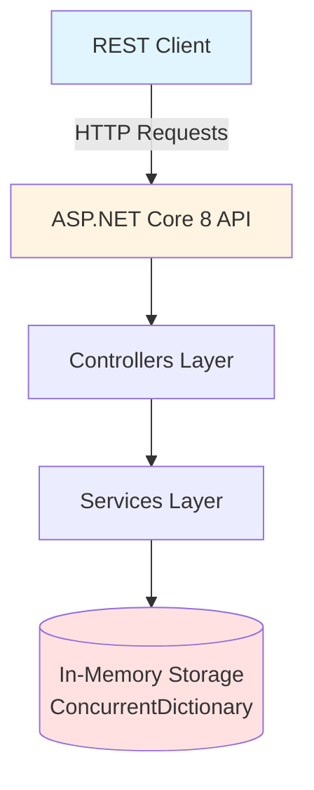
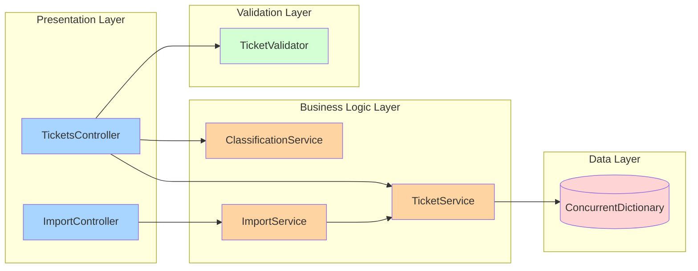
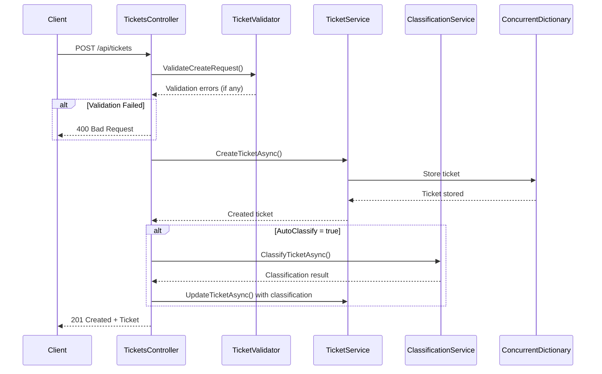
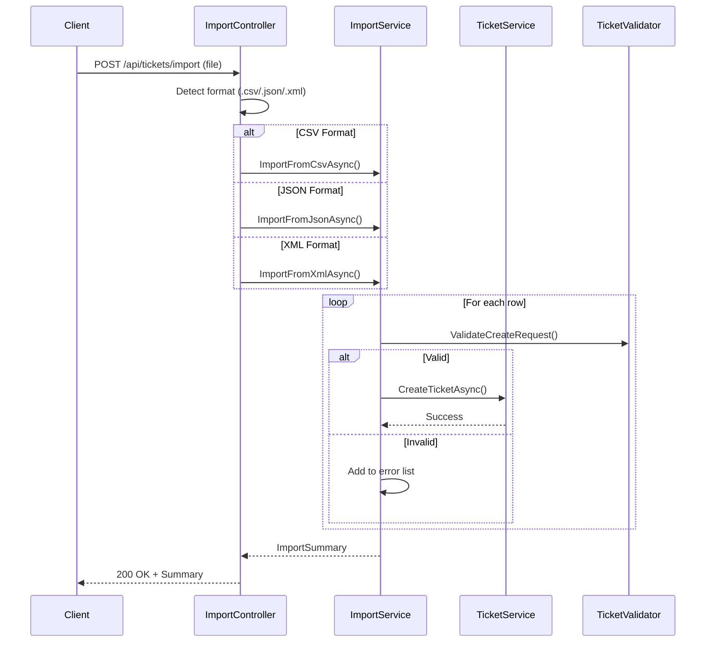

# Architecture — Ticketing API

## System Overview

The Ticketing API is a RESTful service built with ASP.NET Core 8 that provides customer support ticket management with multi-format import and auto-classification capabilities.

### High-Level Architecture



## Component Architecture

### Layer Breakdown



## Core Components

### 1. Controllers

**TicketsController** (`Controllers/TicketsController.cs`)
- Handles all CRUD operations for tickets
- Manages auto-classification requests
- Validates input before passing to services
- Returns appropriate HTTP status codes

**ImportController** (`Controllers/ImportController.cs`)
- Handles bulk import requests
- Detects file format (CSV/JSON/XML)
- Routes to appropriate parser
- Returns import summary with error details

### 2. Services

**TicketService** (`Services/TicketService.cs`)
- Core ticket management logic
- Thread-safe in-memory storage via `ConcurrentDictionary`
- CRUD operations
- Filtering with LINQ
- Auto-increment ID generation

**ClassificationService** (`Services/ClassificationService.cs`)
- Keyword-based classification algorithm
- Analyzes subject + description
- Returns category, priority, and confidence score
- 20+ keywords mapped to categories/priorities

**ImportService** (`Services/ImportService.cs`)
- Three format parsers: CSV (CsvHelper), JSON (System.Text.Json), XML (System.Xml.Linq)
- Row-by-row validation
- Collects errors with row numbers
- Returns summary with success/error counts

### 3. Models

| Model | Purpose |
|-------|---------|
| `Ticket` | Core entity with 13 properties |
| `CreateTicketRequest` | DTO for ticket creation |
| `UpdateTicketRequest` | DTO for ticket updates |
| `TicketFilter` | Filter parameters for queries |
| `ImportSummary` | Bulk import results |
| `ImportError` | Row-level import error details |
| `ClassificationResult` | Auto-classification output |

### 4. Validation

**TicketValidator** (`Validation/TicketValidator.cs`)
- Email regex validation
- String length checks
- Required field validation
- Reusable for both create and import

## Data Flow

### Ticket Creation Flow



### Bulk Import Flow



## Classification Algorithm

### Keyword Mapping

**Category Keywords:**
- **Technical**: login, password, error, bug, crash, slow, performance
- **Billing**: payment, charge, invoice, refund, subscription, bill
- **Account**: account, profile, settings, delete, reset
- **General**: (default when no keywords match)

**Priority Keywords:**
- **Critical**: urgent, critical, asap, immediately, down, outage
- **High**: important, high, soon, blocking
- **Low**: question, help, how
- **Medium**: (default)

### Confidence Scoring

```
confidence = min(1.0, total_keyword_matches * 0.2)
```

Example: 3 keyword matches = 0.6 confidence (60%)

## Storage Strategy

### Why ConcurrentDictionary?

- ✅ Thread-safe for concurrent reads/writes
- ✅ O(1) lookups by ID
- ✅ No locking overhead
- ✅ Simple in-memory solution
- ✅ Suitable for homework scope

### ID Generation

Uses `Interlocked.Increment` for atomic, thread-safe ID increments.

### Filtering

LINQ-based filtering on `ConcurrentDictionary.Values`:
```csharp
tickets.Where(t => t.Status == filter.Status)
       .Where(t => t.CreatedAt >= filter.FromDate)
       .OrderByDescending(t => t.CreatedAt)
```

## Scalability Considerations

### Current Implementation (In-Memory)

| Aspect | Current State |
|--------|---------------|
| Data persistence | ❌ Lost on restart |
| Multi-instance | ❌ Each instance has separate data |
| Max capacity | Limited by RAM |
| Performance | Very fast (in-memory) |

### Production Recommendations

1. **Replace ConcurrentDictionary with EF Core + Database**
   - PostgreSQL, SQL Server, or MySQL
   - Persistent storage
   - Multi-instance support

2. **Add Pagination**
   ```csharp
   .Skip((page - 1) * pageSize).Take(pageSize)
   ```

3. **Add Caching**
   - Redis for frequently accessed tickets
   - Reduce database load

4. **Add Message Queue**
   - RabbitMQ/Azure Service Bus for import jobs
   - Async processing for large files

5. **Add Authentication/Authorization**
   - JWT tokens
   - Role-based access control

## Error Handling

### Validation Errors

Return `400 Bad Request` with structured error response:
```json
{
  "message": "Validation failed",
  "errors": [
    {"field": "customerEmail", "message": "Customer email is not valid"}
  ]
}
```

### Not Found

Return `404 Not Found`:
```json
{
  "message": "Ticket 999 not found"
}
```

### Import Errors

Return `200 OK` with partial success details:
```json
{
  "totalRows": 10,
  "successCount": 8,
  "errorCount": 2,
  "errors": [
    {"rowNumber": 3, "field": "customerEmail", "errorMessage": "..."},
    {"rowNumber": 7, "field": "subject", "errorMessage": "..."}
  ]
}
```

## Technology Stack

| Layer | Technology | Version |
|-------|-----------|---------|
| Framework | ASP.NET Core | 8.0 |
| Language | C# | 12.0 |
| CSV Parsing | CsvHelper | 30.0.1 |
| JSON Parsing | System.Text.Json | Built-in |
| XML Parsing | System.Xml.Linq | Built-in |
| Testing | xUnit + FluentAssertions | 2.6.2 + 6.12.0 |
| Coverage | Coverlet | 6.0.0 |

## Performance Characteristics

| Operation | Complexity | Notes |
|-----------|------------|-------|
| Create ticket | O(1) | ConcurrentDictionary insert |
| Get by ID | O(1) | Dictionary lookup |
| Get all tickets | O(n) | Iterate all tickets |
| Filter tickets | O(n) | LINQ where clauses |
| Delete ticket | O(1) | Dictionary remove |
| Classify ticket | O(m) | m = length of subject + description |
| Import (CSV) | O(n) | n = number of rows |

## Security Considerations

### Current Implementation

- ❌ No authentication
- ❌ No authorization
- ❌ No rate limiting
- ✅ Input validation (SQL injection N/A - no DB)
- ✅ Email regex validation
- ✅ Length limits on all fields

### Production Additions Needed

1. Add JWT authentication
2. Add role-based permissions (Admin, Agent, Customer)
3. Add rate limiting (ASP.NET Core middleware)
4. Add CORS configuration
5. Add HTTPS enforcement
6. Add file upload size limits
7. Add antivirus scanning for imports
