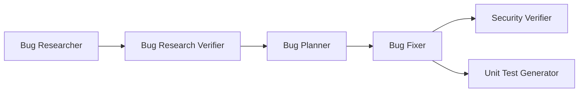

# Homework 4 — 4-Agent Pipeline

**Author / Student:** Vlad Radchenko ([@Vladkee](https://github.com/Vladkee))
**Course:** Gen-AI Course · **Assignment:** [TASKS.md](TASKS.md)
**AI Tools Used:** Claude Code CLI (Claude Fable 5) for the agent system, app, and pipeline execution; per-stage agent models listed below. Session log: [AI-CONVERSATION.md](AI-CONVERSATION.md).

A 4-agent bug-fixing pipeline (Research Verifier → Bug Fixer → Security Verifier → Unit Test
Generator) operating on **SpendLite**, a zero-dependency Node.js expense-tracker API seeded with
2 functional bugs and 1 security issue. The pipeline found, fixed, security-reviewed, and
regression-tested all three — full artifact trail in [`context/bugs/001/`](context/bugs/001/).



## Single-command execution

```bash
npm run pipeline
```

[`scripts/run-pipeline.mjs`](scripts/run-pipeline.mjs) runs all six stages in order via Claude
Code headless mode (`claude -p`), passes each stage its **explicit model**, and each agent stage
loads its agent definition and skills automatically — no manual per-agent invocation. The runner
fails fast if a stage exits non-zero or doesn't produce its expected artifact, and logs every
stage to `context/bugs/001/logs/`. See [HOWTORUN.md](HOWTORUN.md) for prerequisites and how to
re-run from the pristine seeded-bug state.

## Agents and model selection

| Agent | File | Model | Why this model |
|---|---|---|---|
| Bug Research Verifier | [`agents/research-verifier.agent.md`](agents/research-verifier.agent.md) | `claude-opus-4-8` | Verification is high-precision cross-referencing of claims vs. source. Course experience (HW1, HW3) consistently showed Opus-class models catch reference drift that faster models miss — and it did here (see below). |
| Bug Fixer | [`agents/bug-fixer.agent.md`](agents/bug-fixer.agent.md) | `claude-sonnet-5` | The plan already contains exact before/after code; this is disciplined mechanical execution with a test gate after every change. Sonnet-class is sufficient and cheaper. |
| Security Verifier | [`agents/security-verifier.agent.md`](agents/security-verifier.agent.md) | `claude-opus-4-8` | Adversarial reasoning about what's *absent* (missing validation, timing side channels) — the least mechanical stage; strongest model justified. |
| Unit Test Generator | [`agents/unit-test-generator.agent.md`](agents/unit-test-generator.agent.md) | `claude-sonnet-5` | Pattern-following against an explicit skill (FIRST) and explicit scope (fix-summary). Haiku was considered, but generated tests must run green first try; the cost delta at this scale is marginal. |

The supporting inline stages (Bug Researcher, Bug Planner) use `claude-opus-4-8` (root-cause
analysis) and `claude-sonnet-5` (plan transcription from verified research) respectively.

Each agent also exists as a native Claude Code subagent in [`.claude/agents/`](.claude/agents/)
(thin wrappers that load the canonical `agents/*.agent.md` definition), so the agents can be
invoked interactively from `homework-4/` as well as via the pipeline.

## Skills

- [`skills/research-quality-measurement.md`](skills/research-quality-measurement.md) (Task 1.2) —
  quality levels **A / B / C / F** with measurable criteria (reference accuracy, root-cause
  correctness) and the required structure of `verified-research.md`. Levels C/F stop the pipeline.
- [`skills/unit-tests-FIRST.md`](skills/unit-tests-FIRST.md) (Task 4.2) — **F**ast,
  **I**ndependent, **R**epeatable, **S**elf-validating, **T**imely, each mapped to concrete,
  checkable rules for this repo, plus a generator checklist.

## The pipeline run — what actually happened

1. **Researcher** traced all 3 reported symptoms to root causes with file:line evidence
   ([codebase-research.md](context/bugs/001/research/codebase-research.md)).
2. **Research Verifier** re-opened every reference: 13/14 exact, one 2-line drift found and
   corrected → quality **B (Minor Discrepancies)** per the skill; planner cleared to proceed
   ([verified-research.md](context/bugs/001/research/verified-research.md)).
3. **Planner** produced exact before/after changes ([implementation-plan.md](context/bugs/001/implementation-plan.md)).
4. **Bug Fixer** applied 3 changes, `npm test` green after each
   ([fix-summary.md](context/bugs/001/fix-summary.md)).
5. **Security Verifier** confirmed SEC-001 resolved in source (not from the fix summary's word),
   swept the full checklist, and flagged one pre-existing MEDIUM (unvalidated `amount` can
   poison totals with `NaN`) as batch-002 work ([security-report.md](context/bugs/001/security-report.md)).
6. **Unit Test Generator** produced 12 FIRST-compliant tests in
   [`tests/generated/`](tests/generated/); regression tests **proven to fail on the pre-fix
   snapshot** (`context/bugs/001/before/`) and pass post-fix. Final suite: **18/18 green**
   ([test-report.md](context/bugs/001/test-report.md)).

## Seeded issues (before → after)

| Issue | Seeded as | Fixed by |
|---|---|---|
| BUG-001-A | Exclusive `to` date bound — month-end expenses vanish from reports (`before/store.js:27`) | Inclusive bound (`src/store.js:27`) |
| BUG-001-B | Float accumulation — `total: 30.299999999999997` (`before/store.js:38-39`) | Integer-cents accumulation (`src/store.js:35-45`) |
| SEC-001 | Hardcoded admin token, token logged in plaintext, timing-unsafe `==` (`before/auth.js`) | Env-sourced fail-closed token, no logging, `crypto.timingSafeEqual` (`src/auth.js`) |

Pre-fix sources are preserved verbatim in [`context/bugs/001/before/`](context/bugs/001/before/).

## Project structure

```
homework-4/
├── README.md / HOWTORUN.md / AI-CONVERSATION.md
├── agents/                  # 4 agent definitions (model + rationale in frontmatter)
├── .claude/agents/          # Claude Code-native subagent wrappers
├── skills/                  # research-quality-measurement, unit-tests-FIRST
├── scripts/run-pipeline.mjs # single-command pipeline runner
├── src/                     # SpendLite app (fixed state)
├── tests/                   # baseline tests + tests/generated/ (pipeline output)
├── context/bugs/001/        # bug-context, before/, research/, plan, fix/security/test reports
└── docs/screenshots/        # pipeline run, fixes, security scan, unit tests
```

## Running the app

See [HOWTORUN.md](HOWTORUN.md). Quick version: `npm start` (server on :3000), `npm test`
(18 tests, ~100 ms), `npm run pipeline` (full agent chain; needs Claude Code CLI).
